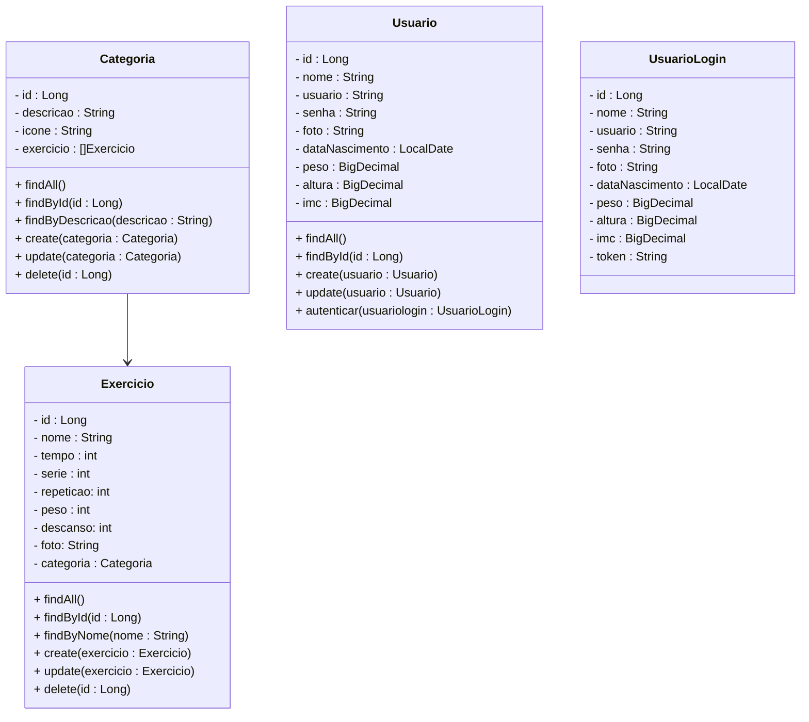
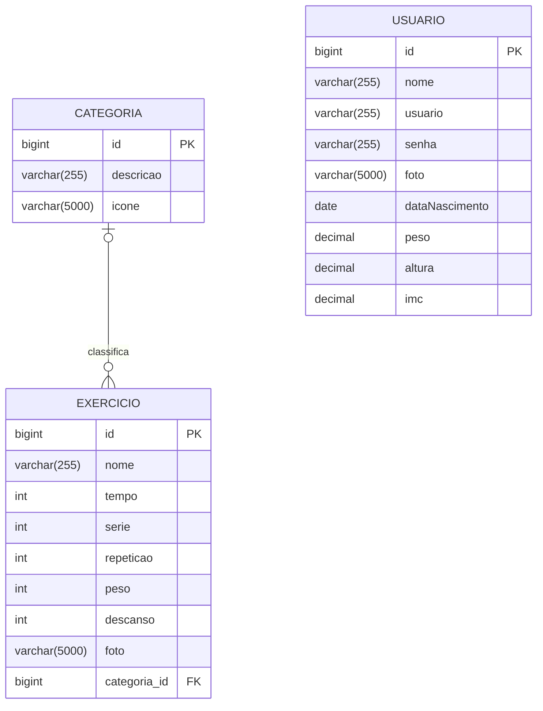

# Projeto Aplicativo Fitness - Backend

 

    

  

## 1. Descrição

Um **Aplicativo Fitness** é uma plataforma digital que auxilia os usuários na prática de atividades físicas e na gestão de sua saúde. Com funções como monitoramento de exercícios, registro de alimentação, acompanhamento de objetivos e suporte para um estilo de vida mais ativo e saudável, os aplicativos fitness são projetados para facilitar a prática de atividades físicas e promover hábitos saudáveis.

### 1.1. Principais Funcionalidades

1. Monitoramento de Exercícios

2. Rastreamento de Saúde

3. Cálculo do IMC e Monitoramento de Peso

4. Planos de Treino e Exercícios Personalizados

5. Controle de Alimentação

6. Gamificação e Desafios diários

7. Integração com Comunidades e Redes Sociais

Os aplicativos fitness são uma solução versátil para qualquer nível de usuário, oferecendo flexibilidade para acompanhar e ajustar a prática de exercícios e a alimentação de forma prática e interativa.

 

## 2. Sobre esta API

O **Projeto Aplicativo Fitness** foi desenvolvido utilizando o Framework **Spring** e a linguagem **Java** para criar a estrutura  básica de um sistema de Aplicativo Fitness. Ela fornece endpoints  para gerenciar os Recursos **Usuário, Categoria e Exercício**, além de efetuar o calculo do IMC (Índice de Massa Corporal), com base no peso e altura do usuário e gerar um Plano de Dieta, com base nos objetivos do usuário.

 

### 2.1. Principais Funcionalidades

1. Cadastro e gerenciamento dos usuários
2. Registro e gerenciamento das categorias
3. Criação e gerenciamento dos exercícios
4. Cálculo do IMC (Índice de Massa Corporal)
5. Geração de Plano de Dieta

 

### 2.2. Cálculo do IMC

O IMC, ou Índice de Massa Corporal, é uma medida usada para avaliar se uma pessoa está dentro de uma faixa de peso saudável em relação à sua altura. É calculado dividindo-se o peso (em quilogramas) pela altura (em metros) elevada ao quadrado. A fórmula é:

$$
IMC= \frac{\text{peso (kg)}}{\text{altura (m)}^2}
$$

O resultado é classificado em categorias, que indicam se a pessoa está abaixo do peso, com peso normal, sobrepeso ou obesidade, como mostra a tabela abaixo:

| IMC               | Classificação       | Descrição                                                    |
| ----------------- | ------------------- | ------------------------------------------------------------ |
| Acima de 40,0     | Obesidade  grau III | Aqui o sinal é vermelho, com forte probabilidade de já  existirem doenças muito graves associadas. O tratamento deve ser ainda  mais urgente. |
| Entre 35,0 e 39,9 | Obesidade  grau II  | Mesmo que seus exames aparentem estar normais, é hora de se cuidar,  iniciando mudanças no estilo de vida com o acompanhamento próximo de  profissionais de saúde. |
| Entre 30,0 e 34,9 | Obesidade  grau I   | Sinal de alerta! Chegou na hora de se cuidar, mesmo que seus exames  sejam normais. Vamos dar início a mudanças hoje! Cuide de sua  alimentação. Você precisa iniciar um acompanhamento com nutricionista  e/ou endocrinologista. |
| Entre 25,0 e 29,9 | Sobrepeso           | Ele é, na verdade, uma pré-obesidade e muitas pessoas nessa faixa já  apresentam doenças associadas, como diabetes e hipertensão. Importante  rever hábitos e buscar ajuda antes de, por uma série de fatores, entrar  na faixa da obesidade pra valer. |
| Entre 18,6 e 24,9 | Normal              | Que bom que você está com o peso normal! E o melhor jeito de continuar  assim é mantendo um estilo de vida ativo e uma alimentação equilibrada. |
| 18,5 ou menos     | Abaixo do normal    | Procure um médico. Algumas pessoas têm um baixo peso por características do seu organismo e tudo bem. Outras podem estar enfrentando problemas, como a  desnutrição. É preciso saber qual é o caso. |

 

### 2.3. Geração do Plano de Dietas

Para gerar o Plano de Dieta, será utilizada a API do Google Gemini. 

 

## 3. Integração com a API - Google Gemini

O **Google Gemini** é uma família de modelos de inteligência artificial (IA) desenvolvida pelo Google DeepMind. Ele é projetado para processar múltiplos tipos de dados (texto, imagem, áudio e código) e pode ser utilizado em diversas aplicações, como assistentes virtuais, geração de texto, análise de imagens e mais.

A API do **Google Gemini** será utilizada pelo no Projeto Aplicativo Fitness para gerar um Plano de Dietas para o usuário, de acordo com o IMC e o objetivo do usuário.

 

### 3.1. Passos para integração com a API do Gemini:

1. Criar um projeto no [Google Cloud Console](https://console.cloud.google.com)
2. Ativar a **API do Gemini** e gerar uma **chave de API (APi KEY)**
3. Adicionar a chave de API e a URL da API em variáveis de ambiente no Projeto Aplicativo Fitness

 

## 4. Diagrama de Classes

*O atributo imc, da entidade Usuário, é um campo calculado.*

 

## 5. Diagrama Entidade-Relacionamento (DER)

 

## 6. Tecnologias utilizadas

| Item                          | Descrição       |
| ----------------------------- | --------------- |
| **Servidor**                  | Tomcat          |
| **Linguagem de programação**  | Java            |
| **Framework**                 | Spring          |
| **ORM**                       | JPA + Hibernate |
| **Banco de dados Relacional** | MySQL           |

 

## 7. Configuração e Execução

1. Clone o repositório
2. Abra o Projeto no STS e aguarde a instalação das dependências
3. Configure o banco de dados no arquivo `application.properties`
4. Configure as variáveis de ambiente no arquivo `.env`
5. Execute a aplicação via STS

